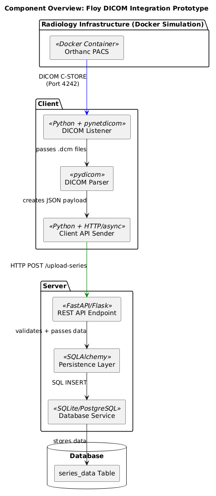
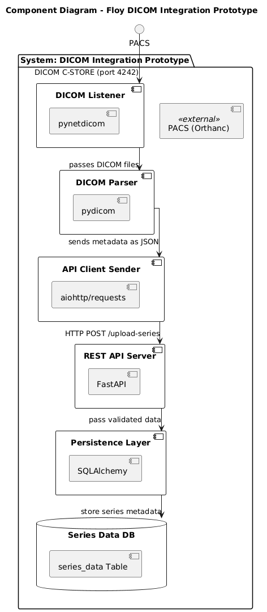
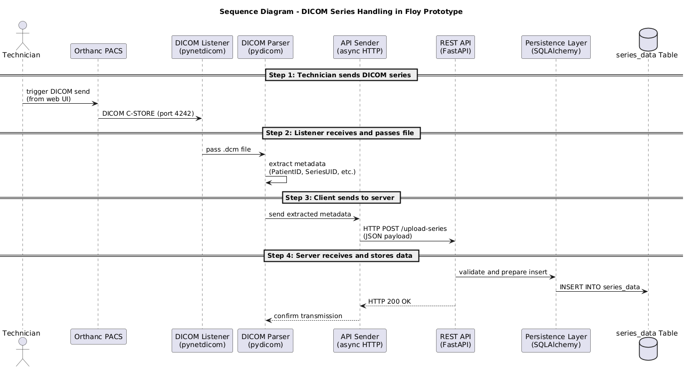

# Floy Software Challenge: Client-Server-System for DICOM Data


## Project Overview
This project is a prototypical, asynchronous client-server system for receiving, extracting, and storing DICOM metadata. The goal is to realistically simulate the radiology workflow using a self-developed system — from image acquisition via PACS to structured storage of image metadata in a database.

## Project Structure

```
floy_challenge/
│
├── client/                 # Client: receives DICOM files from PACS
│   └── receiver.py         # Main logic: reception, series collection, metadata extraction, transmission
│
├── scp.py                  # DICOM SCP (Store) server for receiving data via port 6667
│
├── server/                 # Server: FastAPI + SQLite for storing metadata
│   ├── main.py             # API endpoint: /upload-series
│   ├── models.py           # Pydantic + SQLAlchemy models
│   ├── db.py               # Database configuration
│   └── persistence.py      # Persistence logic
|
├── tests/                  # Testcases (Unit, Integration, API, End-to-End)
│   ├── test_api.py
│   ├── test_api_invalid.py
│   ├── test_db_persistence.py
│   ├── test_extraction.py
│   ├── test_integration_pipeline.py
│   └── test_bulk_series_upload.py
│
├── diagrams/                   # UML-Diagrams
│   ├── component-diagram.png
│   ├── component-overview.png
│   └── sequence-diagram.png
│
├── requirements.txt
└── README.md
```
## Functionality

### Client

- Receives DICOM images via DICOM SCP (`pynetdicom`)
- Groups images into complete **series** based on `SeriesInstanceUID`
- Uses **timeout-based heuristic** to determine series completeness
- Extracts metadata from complete series using `pydicom`
- Sends metadata as JSON to server endpoint via `httpx.AsyncClient`

### Server

- RESTful API with `/upload-series` (FastAPI)
- Validates input using Pydantic schema
- Persists metadata using SQLAlchemy into SQLite DB
- Enforces uniqueness on `SeriesInstanceUID`

## Testing

### Unit Tests

- Metadata extraction from valid and invalid DICOM files (`test_extraction.py`)

### API Tests

- Successful data transmission (`test_api.py`)
- Handling of invalid or missing fields (`test_api_invalid.py`)

### Persistence Test

- End-to-end check for correct database insertion (`test_db_persistence.py`)

### Integration Test

- Full pipeline: file reception → extraction → POST → DB insert (`test_integration_pipeline.py`)

### Bulk Upload Test

- Tests transmission of multiple DICOM files from a directory with logging (saved in `logs/bulk_test_<FOLDERNAME>_<TIMESTAMP>.log`)
- Skips duplicate `SeriesInstanceUID` entries gracefully  (`test_bulk_series_upload.py`)

## Architecture & Design

### Component Overview



### Component Diagram



### Sequence Diagram



## Design Decisions & Special Features

### Why Async?
Asynchronous programming (`asyncio`) enables non-blocking, concurrent operations. In this project, it ensures that the client can continuously listen for incoming DICOM data from the PACS without freezing or requiring a manual restart. This reflects real-world radiology environments, where new series may arrive unpredictably, and the system must remain responsive at all times.

### Why httpx and FastAPI?
- **FastAPI** was chosen for the server because of its simplicity, modern syntax, and built-in support for asynchronous request handling and Pydantic-based data validation. It allowed for rapid development of a robust RESTful API with minimal boilerplate.

- **httpx** was selected on the client side for sending HTTP requests asynchronously. Unlike the standard `requests` library, `httpx` supports `async/await`, aligning perfectly with the architecture of this project.

### Series Logic (Timeout-Based Dispatch & Series Detection)
The DICOM standard does not define when a series transmission is complete. Therefore, the client implements a timeout-based heuristic:

- A series is considered "complete" when no new instances have been received within a predefined interval (e.g., 1 second).
- Series are grouped by their `SeriesInstanceUID`.
- The system assumes that only one series is transmitted at a time for simplicity.

This design mimics real PACS transmissions while avoiding premature dispatching.

### Error Handling (e.g. Duplicate Entries)
The server uses:

- **Pydantic** for strict request validation (e.g., correct types, all fields required).
- **SQLAlchemy** with a uniqueness constraint on `SeriesInstanceUID` to prevent duplicate entries.

When a duplicate `SeriesInstanceUID` is submitted:

- A database `IntegrityError` is raised.
- The system logs the error and returns a 500 Internal Server Error.

In practice, this behavior could be improved by returning a custom `409 Conflict` with a clear explanation.

> A future improvement could include idempotent inserts or update-on-conflict strategies to gracefully handle duplicates.

## Setup & Usage

### Prerequisites

- Python ≥ 3.7
- Docker (for PACS simulation)

### Install dependencies
```bash
pip install -r requirements.txt
```

### Run Tests
```bash
PYTHONPATH=. pytest -v
```

### Send Data from PACS (Manual)
In Orthanc:
Manual Upload DICOMs → “All Studies” → Pick a Series → “Send to DICOM modality” → Tech_Challenge

## Start Server (API)
```bash
uvicorn server.main:app --reload
```
## Run PACS via Docker
```bash
docker run -p 4242:4242 -p 6667:6667 -p 8042:8042 floymedical/pacs_technical_challenge
```
Web UI: http://localhost:8042
Login: orthanc / orthanc

## Start Client SCP Receiver
```bash
python scp.py
```
## Design Decisions & possible Trade-offs
Modularization of receiver.py and scp.py into subpackages (e.g., handlers/, utils/)
→ Kept together intentionally, as the current structure remains clear and the separation did not yet provide significant architectural benefit.

Returning HTTP 409 Conflict for duplicate series instead of 500
→ I am aware of the more accurate status code but opted to keep the implementation minimal, focusing on functional correctness.

Runtime logging during live operation (not just test logging)
→ Logging is currently implemented for testing purposes only; extending it to runtime is a conscious next step for production readiness.

Centralizing constants in a config.py (e.g., ports, timeouts, paths)
→ Constants are defined inline to preserve simplicity during development; modularization is acknowledged as a future improvement.

## Challenge Questions

Answers to the architectural and security questions can be found in [questions.md](./questions.md).

## Submission Summary (Author’s Note)

This repository represents my solution to the Floy Software Challenge. It simulates a realistic PACS integration using an asynchronous client-server architecture built in Python. The system receives DICOM files via SCP, extracts relevant metadata, and sends it to a REST API for structured storage.

✅ Full test coverage (unit, API, integration, bulk upload)  
✅ Robust handling of duplicate data & series completion logic  
✅ Modular design and clean architecture (documented with UML diagrams)  
✅ Manual and automated usage options (live Orthanc + CLI test scripts)

